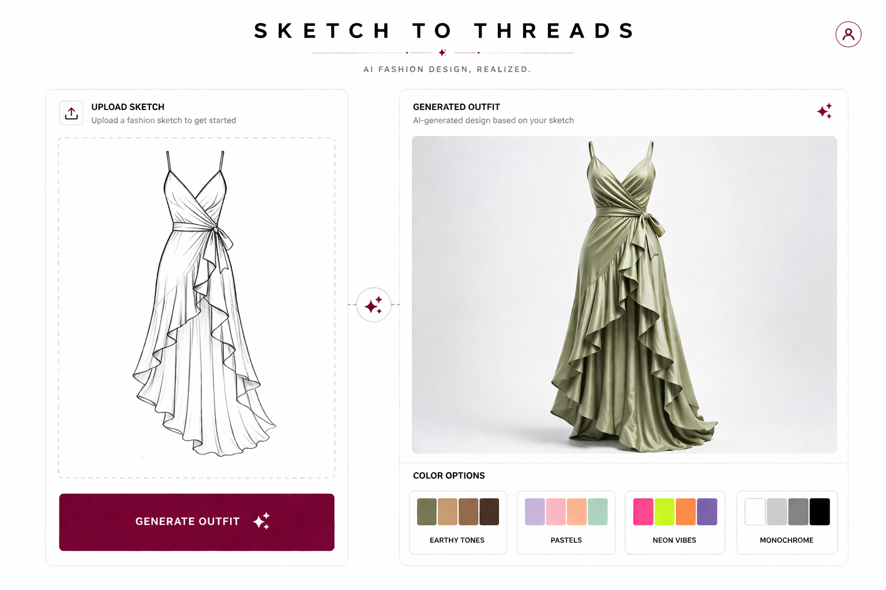

# Palette Attention Model

A memory-based deep learning system for fashion generation using RNNs, LSTMs, and GRUs with conditional spatial attention — built without Transformers.

## Demo Screenshots


## Overview

This project implements a sequential generative architecture for fashion tasks, focusing on two core capabilities:

- **Sequential outfit generation** — generating coherent outfit sequences token by token using recurrent memory
- **Sketch-to-outfit synthesis** — translating edge maps and silhouettes into complete outfit reconstructions

The design philosophy is strict: no Transformers, no self-attention over full sequences. Instead, spatial attention is applied conditionally at each recurrent step to maintain structural constraints and prevent color bleeding during recursive generation.

## Architecture

```
Inputs
 ├── Sketch (edge map + silhouette)   →  CNN Encoder (ResNet-18 backbone, frozen)
 ├── Outfit sequence (tokens)         →  Embedding Layer + Linear Projection
 └── Style condition (category, tag)  →  Conditional Embedding

                    ↓  concat / fuse

          Stacked LSTM / GRU (2 layers, hidden 256–512)
          + Conditional Spatial Attention
                 (masked softmax over spatial feature map)

                    ↓

          Spatial Attention Decoder
          (structural constraints, anti-bleeding mask)

          ↓                          ↓
Sequential outfit output     Sketch-to-outfit synthesis
(token sequence)             (pixel-level reconstruction)
```

### Key design decisions

- **No Transformers** — recurrent units (LSTM/GRU) are used exclusively for sequential memory
- **Conditional spatial attention** — attention maps are computed per recurrent step, conditioned on the current hidden state and style vector
- **Structural masking** — silhouette-derived binary masks are applied before softmax to prevent activations leaking across garment boundaries (color bleeding suppression)
- **Pretrained CNN backbone** — ResNet-18 is used frozen as a feature extractor; only the LSTM and attention layers are trained from scratch


## Tech Stack

| Component | Library / Tool |
|---|---|
| Framework | PyTorch |
| CNN Backbone | `torchvision` ResNet-18 (pretrained, frozen) |
| Recurrent core | `nn.LSTM` / `nn.GRU` |
| Spatial attention | Custom conv module (2-layer, masked softmax) |
| Dataset | DeepFashion / FashionGen |
| Preprocessing | Pillow, `torchvision.transforms` |
| Experiment tracking | Weights & Biases |
| Demo UI | Gradio |


## Project Structure

```
palette-attention-model/
│
├── 📁 data/
│   ├── dataset.ipynb          # PyTorch Dataset + DataLoader
│   └── preprocess.ipynb       # Edge map extraction, normalization
│
├── 📁 models/
│   ├── encoder.ipynb          # CNN encoder (ResNet-18 backbone)
│   ├── embedding.ipynb        # Token + conditional style embeddings
│   ├── lstm_core.ipynb        # Stacked LSTM/GRU with hidden state management
│   ├── attention.ipynb        # Conditional spatial attention module
│   └── decoder.ipynb          # Spatial attention decoder + output heads
│
├── 📁 notebooks/
│   ├── 01_data_exploration.ipynb      # Data loading and preprocessing
│   ├── 02_model_architecture.ipynb    # Architecture visualization
│   ├── 03_training_analysis.ipynb     # Loss curves and metrics
│   └── 04_results_visualization.ipynb # Attention maps and outputs
│
├── 📁 configs/
│   └── default.yaml           # Hyperparameters and configuration
│
├── train.ipynb                # Training loop, loss functions, gradient clipping
├── evaluate.ipynb             # Evaluation, attention map visualization, FID
├── demo.ipynb                 # Gradio interface
├── main.ipynb                 # Main PaletteAttentionModel orchestration
├── utils.ipynb                # Utility functions and helpers
├── requirements.txt           # Python dependencies
├── INSTALLATION.md            # Installation and setup guide
└── README.md                  # Project documentation
```


## Getting Started

### Requirements

- Python 3.9+
- PyTorch 2.0+ with CUDA
- NVIDIA GPU (recommended: 8GB+ VRAM)

### Installation

```bash
git clone https://github.com/Manjushwarofficial/palette-attention-model.git
cd palette-attention-model

conda create -n palette-attn python=3.9
conda activate palette-attn

pip install torch torchvision pillow wandb gradio pyyaml
```

### Data

Download a subset of [DeepFashion](http://mmlab.ie.cuhk.edu.hk/projects/DeepFashion.html) and place it under `data/raw/`. Start with 5–10k samples for initial training runs.

Run the preprocessing notebook:
- Open `data/preprocess.ipynb` and execute cells to generate edge maps and silhouettes
- Or use the command line:
```bash
jupyter nbconvert --to script data/preprocess.ipynb --output preprocess.py && python preprocess.py --input data/raw/ --output data/processed/
```

### Training

Open and run `train.ipynb` for interactive training, or:
```bash
jupyter nbconvert --to script train.ipynb --output train.py && python train.py --config configs/default.yaml
```

Key config options in `configs/default.yaml`:

```yaml
model:
  hidden_size: 256
  num_layers: 2
  attention_heads: 1       # spatial, not multi-head

training:
  lr: 1e-3
  grad_clip: 1.0           # mandatory for LSTM stability
  warmup_steps: 500
  batch_size: 32
  epochs: 50
```

Losses are logged to Weights & Biases. Sample outputs are saved every 500 steps.

### Demo

Open `demo.ipynb` to launch Gradio interface, or:
```bash
jupyter nbconvert --to script demo.ipynb --output demo.py && python demo.py
```

Launches a local Gradio interface for sketch input → outfit generation.


## Spatial Attention & Anti-Bleeding Mechanism

The spatial attention module outputs a 2D attention map over the CNN feature grid. At each recurrent step:

1. The current LSTM hidden state and style condition vector are projected and broadcast over the spatial grid
2. A 2-layer conv net computes raw attention logits
3. A **binary silhouette mask** (derived from the sketch input) sets out-of-garment logits to `-inf` before softmax
4. The masked attention map is applied to the feature map, producing a context vector for the decoder

This masking step is the primary mechanism preventing color bleeding — activations from outside garment boundaries cannot contribute to generation.


## Evaluation

```bash
python evaluate.py --checkpoint checkpoints/best.pt --split val
```

Metrics computed:

- **Reconstruction loss** — MSE + perceptual loss (VGG features) for synthesis task
- **Sequence accuracy** — token-level for outfit generation
- **FID** — Fréchet Inception Distance on generated vs real outfits
- **Attention visualization** — spatial maps overlaid on input sketch to verify structural constraint adherence


## Limitations

- No global sequence attention (by design) — long-range outfit coherence relies entirely on LSTM memory
- Color fidelity depends on quality of silhouette masks; noisy sketches degrade anti-bleeding performance
- Trained on DeepFashion distribution; may not generalize to non-standard garment shapes


## License

MIT
