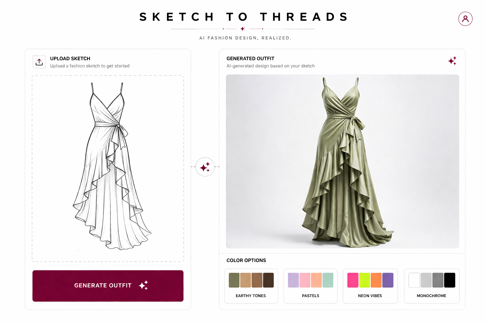

# Palette Attention Model

A memory-based deep learning system for fashion generation using RNNs, LSTMs, and GRUs with conditional spatial attention — built without Transformers.

## Demo Screenshots


## Overview

This project implements a sequential generative architecture for fashion tasks, focusing on two core capabilities:

- **Sequential outfit generation** — generating coherent outfit sequences token by token using recurrent memory
- **Sketch-to-outfit synthesis** — translating edge maps and silhouettes into complete outfit reconstructions

The design philosophy is strict: no Transformers, no self-attention over full sequences. Instead, spatial attention is applied conditionally at each recurrent step to maintain structural constraints and prevent color bleeding during recursive generation.

## Architecture

```
Inputs
 ├── Sketch (edge map + silhouette)   →  CNN Encoder (ResNet-18 backbone, frozen)
 ├── Outfit sequence (tokens)         →  Embedding Layer + Linear Projection
 └── Style condition (category, tag)  →  Conditional Embedding

                    ↓  concat / fuse

          Stacked LSTM / GRU (2 layers, hidden 256–512)
          + Conditional Spatial Attention
                 (masked softmax over spatial feature map)

                    ↓

          Spatial Attention Decoder
          (structural constraints, anti-bleeding mask)

          ↓                          ↓
Sequential outfit output     Sketch-to-outfit synthesis
(token sequence)             (pixel-level reconstruction)
```

### Key design decisions

- **No Transformers** — recurrent units (LSTM/GRU) are used exclusively for sequential memory
- **Conditional spatial attention** — attention maps are computed per recurrent step, conditioned on the current hidden state and style vector
- **Structural masking** — silhouette-derived binary masks are applied before softmax to prevent activations leaking across garment boundaries (color bleeding suppression)
- **Pretrained CNN backbone** — ResNet-18 is used frozen as a feature extractor; only the LSTM and attention layers are trained from scratch


## Tech Stack

### Core Deep Learning

| Component | Library / Tool | Version |
|---|---|---|
| **Framework** | PyTorch | 2.0+ |
| **GPU Support** | CUDA Toolkit | 11.8+ (recommended) |
| **Device Management** | `torch.cuda` | — |

### Model Architecture

| Component | Library / Tool | Purpose |
|---|---|---|
| **CNN Backbone** | `torchvision.models.resnet18` | Feature extraction (frozen, pretrained on ImageNet) |
| **Recurrent Core** | `nn.LSTM` / `nn.GRU` | Sequential memory (2 stacked layers, 256–512 hidden dims) |
| **Spatial Attention** | Custom `nn.Module` (2-layer Conv net) | Conditional attention with silhouette masking |
| **Embedding Layers** | `nn.Embedding` + `nn.Linear` | Token & style embeddings (color vocab: 52, category vocab: 27) |
| **Output Heads** | `nn.Linear` + softmax/MSE | Token prediction & pixel reconstruction |

### Data & Preprocessing

| Component | Library / Tool | Purpose |
|---|---|---|
| **Dataset** | Myntra Fashion Product Dataset | Primary training data (~10k–50k samples) |
| **Image Handling** | `Pillow (PIL)` | Image loading, resizing, format conversion |
| **Transformations** | `torchvision.transforms` | Normalization, augmentation (random crops, flips) |
| **PyTorch Utilities** | `torch.utils.data.Dataset` / `DataLoader` | Batch loading with parallel workers |

### Training & Optimization

| Component | Library / Tool | Purpose |
|---|---|---|
| **Optimizer** | `torch.optim.Adam` | Gradient-based optimization (betas: [0.9, 0.999], lr: 1e-4) |
| **Scheduler** | Cosine Annealing (`torch.optim.lr_scheduler.CosineAnnealingLR`) | Learning rate decay over epochs |
| **Loss Functions** | MSE + Perceptual (VGG-16) + Cross-Entropy | Multi-task synthesis & sequence prediction |
| **Gradient Clipping** | `torch.nn.utils.clip_grad_norm_` | Stability (clip value: 0.5) |

### Evaluation & Visualization

| Component | Library / Tool | Purpose |
|---|---|---|
| **FID Computation** | Custom module with InceptionV3 | Evaluate generated vs. real outfit quality |
| **Perceptual Loss** | Pre-trained VGG-16 (layer 16 features) | Feature-space reconstruction loss |
| **Experiment Tracking** | Weights & Biases (WandB) | Logging metrics, loss curves, checkpoints |
| **Attention Visualization** | `matplotlib` | Overlaying attention maps on input sketches |

### User Interface & Deployment

| Component | Library / Tool | Purpose |
|---|---|---|
| **Interactive Demo** | Gradio | Web-based UI for sketch-to-outfit inference |
| **Notebook Environment** | Jupyter Notebooks | Interactive development & analysis |

### Utilities & Configuration

| Component | Library / Tool | Purpose |
|---|---|---|
| **Configuration** | PyYAML (`pyyaml`) | Hyperparameter management (`configs/default.yaml`) |
| **Utilities** | Custom Python modules (`utils.ipynb`) | Helper functions, IO, checkpoint management |


## Project Structure

```
palette-attention-model/
│
├── 📁 data/
│   ├── dataset.ipynb          # PyTorch Dataset + DataLoader
│   └── preprocess.ipynb       # Edge map extraction, normalization
│
├── 📁 models/
│   ├── encoder.ipynb          # CNN encoder (ResNet-18 backbone)
│   ├── embedding.ipynb        # Token + conditional style embeddings
│   ├── lstm_core.ipynb        # Stacked LSTM/GRU with hidden state management
│   ├── attention.ipynb        # Conditional spatial attention module
│   └── decoder.ipynb          # Spatial attention decoder + output heads
│
├── 📁 notebooks/
│   ├── 01_data_exploration.ipynb      # Data loading and preprocessing
│   ├── 02_model_architecture.ipynb    # Architecture visualization
│   ├── 03_training_analysis.ipynb     # Loss curves and metrics
│   └── 04_results_visualization.ipynb # Attention maps and outputs
│
├── 📁 configs/
│   └── default.yaml           # Hyperparameters and configuration
│
├── train.ipynb                # Training loop, loss functions, gradient clipping
├── evaluate.ipynb             # Evaluation, attention map visualization, FID
├── demo.ipynb                 # Gradio interface
├── main.ipynb                 # Main PaletteAttentionModel orchestration
├── utils.ipynb                # Utility functions and helpers
├── requirements.txt           # Python dependencies
├── INSTALLATION.md            # Installation and setup guide
└── README.md                  # Project documentation
```


## Getting Started

### Requirements

- Python 3.9+
- PyTorch 2.0+ with CUDA
- NVIDIA GPU (recommended: 8GB+ VRAM)

### Installation

```bash
git clone https://github.com/Manjushwarofficial/palette-attention-model.git
cd palette-attention-model

conda create -n palette-attn python=3.9
conda activate palette-attn

pip install torch torchvision pillow wandb gradio pyyaml
```

### Data

Download the [Myntra Fashion Product Dataset](https://www.kaggle.com/datasets/hiteshsuthar101/myntra-fashion-product-dataset/code) and place it under `data/raw/`. Start with 5–10k samples for initial training runs.

Run the preprocessing notebook:
- Open `data/preprocess.ipynb` and execute cells to generate edge maps and silhouettes
- Or use the command line:
```bash
jupyter nbconvert --to script data/preprocess.ipynb --output preprocess.py && python preprocess.py --input data/raw/ --output data/processed/
```

### Training

Open and run `train.ipynb` for interactive training, or:
```bash
jupyter nbconvert --to script train.ipynb --output train.py && python train.py --config configs/default.yaml
```

Key config options in `configs/default.yaml`:

```yaml
# configs/default.yaml
# Default configuration for Palette Attention Model

model:
  encoder:
    backbone: resnet18
    pretrained: true
    freeze_backbone: true
    input_adapter_channels: 1
    output_channels: 512

  embedding:
    colour_vocab_size: 52
    category_vocab_size: 27
    embed_dim: 64

  lstm_core:
    encoder_dim: 512
    style_dim: 128
    hidden_size: 256
    num_layers: 2
    dropout: 0.1
    rnn_type: gru

  attention:
    encoder_dim: 512
    hidden_size: 256
    style_dim: 128
    attn_dim: 256
    use_silhouette_mask: true

  decoder:
    context_dim: 512
    lstm_dim: 256
    style_dim: 128
    vocab_size: 27
    dropout: 0.1

training:
  batch_size: 32
  epochs: 50
  lr: 0.0001
  grad_clip: 0.5
  warmup_steps: 500
  save_every: 5
  log_every: 50
  betas: [0.9, 0.999]
  weight_decay: 0.00001

loss:
  mse_weight: 1.0
  perceptual_weight: 0.1
  token_weight: 0.1
  vgg_layer: 16

scheduler:
  type: cosine_annealing
  T_max: 50
  eta_min: 0.000001

data:
  vocab_dir: /kaggle/input/datasets/manjushwarkhairkar/vocab_and_category
  img_size: 224
  train_split: 0.8
  val_split: 0.1
  test_split: 0.1
  num_workers: 2
  pin_memory: false
  random_seed: 42
  img_mean: [0.485, 0.456, 0.406]
  img_std: [0.229, 0.224, 0.225]
  sketch_mean: [0.5]
  sketch_std: [0.5]

evaluation:
  checkpoint_dir: /kaggle/working/checkpoints
  best_model: /kaggle/working/checkpoints/best_model.pt
  output_dir: /kaggle/working/outputs
  save_interval: 5
  eval_interval: 1
  metrics:
    compute_fid: true
    compute_perceptual: true
    visualize_attention: true

logging:
  log_interval: 50
  save_samples_interval: 500
  use_wandb: false
  wandb_project: palette-attention
  output_dir: /kaggle/working/outputs

device:
  cuda: true
  device_id: 0
```

Losses are logged to Weights & Biases. Sample outputs are saved every 500 steps.


## Spatial Attention & Anti-Bleeding Mechanism

The spatial attention module (defined in `models/attention.ipynb`) is the core mechanism for structural constraint enforcement during generation. At each recurrent step:

1. **State projection** — the current LSTM hidden state (256–512 dims) and conditional style vector (128 dims) are linearly projected to match the encoder feature dimension
2. **Broadcast & fusion** — projected vectors are broadcast over the spatial feature grid (e.g., 7×7 for ResNet-18) and fused with the encoder features
3. **Attention logit computation** — a 2-layer convolutional network (with ReLU activation) computes raw spatial attention logits over the grid
4. **Silhouette masking** — a binary mask derived from the sketch silhouette is applied; logits outside garment boundaries are set to `-inf` before softmax
5. **Context extraction** — the softmax-normalized attention map weights the encoder feature map spatially, producing a context vector for the decoder

**Anti-bleeding mechanism:** By masking out-of-garment regions before softmax, activations from outside the garment silhouette are prevented from contributing to any decoder output. This ensures generated colors and textures remain within structural boundaries.

The `models/decoder.ipynb` then uses this context vector along with the current LSTM hidden state to predict:
- Token probabilities (for sequential outfit generation)
- Pixel values (for sketch-to-outfit synthesis)


## Evaluation

Open and run `evaluate.ipynb` for comprehensive model assessment, or convert to script:

```bash
jupyter nbconvert --to script evaluate.ipynb --output evaluate.py && python evaluate.py --checkpoint checkpoints/best_model.pt --split val
```

**Evaluation metrics computed:**

- **Reconstruction loss** — MSE loss + perceptual loss (VGG-16 features at layer 16) for sketch-to-outfit synthesis task
- **Token-level accuracy** — fraction of correctly predicted color/category tokens in outfit sequences
- **FID (Fréchet Inception Distance)** — statistical distance between generated outfit embeddings and real outfit embeddings using InceptionV3
- **Attention map visualization** — spatial attention maps overlaid on input sketches; validates that attention peaks align with garment boundaries and respects silhouette constraints
- **Spatial constraint adherence** — binary evaluation: does attention remain within the silhouette mask across all timesteps?

Results are logged to Weights & Biases (if enabled in config) and attention visualizations are saved to the output directory specified in `configs/default.yaml`.


## Limitations

- No global sequence attention (by design) — long-range outfit coherence relies entirely on GRU memory
- Color fidelity depends on quality of silhouette masks; noisy sketches degrade anti-bleeding performance
- Trained on the Myntra Fashion Product Dataset; may not generalize well to non-Indian or non-ethnic garment styles
- Colour and category vocabularies are fixed at 52 and 27 entries respectively — unseen values at inference are not supported without retraining
- `freeze_backbone: true` limits fine-tuning of the ResNet18 encoder, which may reduce performance on sketch inputs that differ significantly from RGB pretraining distribution
- FID and perceptual metrics require sufficient GPU memory; evaluation may be slow or infeasible on CPU-only environments
- Dataset lacks explicit outfit-pairing labels, so multi-garment coherence is learned implicitly rather than supervised
- `pin_memory: false` and `num_workers: 2` are conservative settings suitable for Kaggle; throughput may bottleneck on larger local machines without adjustment

## License

MIT
